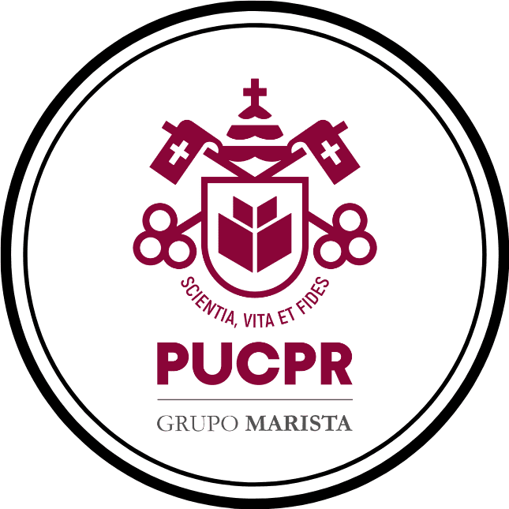

<div align="center">
  

  <h1>Portfólio — Quem Sou Eu?</h1>
  <p>Atividade acadêmica · Experiência Criativa · PUCPR 2025</p>

  
  
  
  
</div>

---

## Sobre o projeto

Single-page portfolio desenvolvido para a atividade **"Quem Sou Eu?"** da disciplina de Experiência Criativa da PUCPR. O design une a estética do jogo [Balatro](https://www.playbalatro.com/) com o minimalismo do portfólio de Bill Chien — cartas de baralho, fichas de poker e uma paleta escura com dourado, vermelho e roxo.

> **Experimento 100% IA:** todo o código, conteúdo e decisões de design foram gerados com [Claude Code](https://claude.ai/code) (Anthropic), sem escrever uma linha sequer manualmente. O objetivo foi testar as capacidades reais de um assistente de IA no ciclo completo de desenvolvimento front-end — do conceito ao produto final.

---

## Seções

| Seção | Descrição |
|---|---|
| **Hero** | Carta flutuante com foto, efeito glitch no nome e scroll hint |
| **Sobre Mim** | Apresentação pessoal com card estilizado |
| **Curiosidades** | 5 flip-cards com carta de Yu-Gi-Oh no verso + véu de transição |
| **Hobbies** | Cards com efeito de tilt 3D magnético |
| **Disciplinas** | Leque de cartas de baralho com as matérias favoritas |
| **Projetos** | Joker Cards com ciclagem de screenshots no hover |

---

## Stack

- **HTML5** semântico com atributos ARIA
- **CSS3** puro: variáveis, `@keyframes`, `perspective`, `backface-visibility`, Grid, Flexbox
- **JavaScript** vanilla: IntersectionObserver, ciclagem de imagens, nav scroll-spy, efeito magnético
- Fonte customizada `Balatro.otf` via `@font-face`
- Nenhum framework, nenhuma dependência externa

---

## Como rodar

```bash
# Clone o repositório
git clone https://github.com/0Londero/portfolio.git

# Abra direto no navegador
open index.html
# ou no VS Code: clique com botão direito → Open with Live Server
```

Não há build step. É HTML estático puro.

---

## Estrutura

```
portfolio/
├── index.html          # Estrutura e conteúdo
├── style.css           # Todo o design system
├── script.js           # Interatividade
├── fonts/
│   └── balatro.otf.woff2
└── images/
    ├── pucpr.png
    ├── Foto perfil.jpg
    ├── pokerchip.png
    ├── yugiohbackcard.png
    ├── jogo (1-6).jpeg  # Screenshots Letheus
    └── app (1-5).jpeg   # Screenshots Explorando Ubuntu
```

---

## Projetos apresentados

**Letheus** — plataformer cyberpunk 2D desenvolvido no Construct. Personagem mascarado, cenário de néon violeta, mecânicas de combate construídas do zero.

**Explorando Ubuntu** — aplicativo multimídia interativo sobre Linux, desenvolvido no Processing. Cobre História, Kernel, Comandos, Pacotes, Segurança e Redes.

---

## Licença

Distribuído sob a licença MIT. Consulte [LICENSE](LICENSE) para mais detalhes.

---

<div align="center">
  <sub>Otávio Londero · PUCPR · 2025 · Feito 100% com IA</sub>
</div>
